# Kid's World

- Deployed website - [kidsworld.heroku.com]( https://kidsworld.herokuapp.com/ )
- Github repository - [kidsworld github repository]( https://github.com/BlueCodeThree/KidsWorld )

A two-sided marketplace where people can buy and sell kids products, such as toys, clothes and more.

## Problem and Purpose

When it comes to babies and children, often they need many items that only get used for a short amount of time - they outgrow or lose interest in things quickly. Parents may rather pay a little bit less for second hand items, and also want to sell off items that are no longer being used. Our Kid's World application is a place where people can buy and sell their new or used children's items.

## Functionality and Features

The aim of our website is to buy and sell children's items. The main functionality when arriving at the website is the user is able to browse the items that are available for sale. In the top menu, a user can select a category to view. In a future implementation, the user will be able to sort the items by price or by condition (new, used etc), for example.

In a future implementation we also plan to add pagination to our all items and category pages, so that the user is not presented with all of the items on a single page. This will allow for faster loading times, and will mean that the user isn't overloaded with too much choice.

A user can purchase any of the items, but when they go to checkout the user must be logged in, in order to pay for the item. We decided that only one item can be purchased at a time, so that our users do not get confused as to the location/the seller of each item.

We decided that with the payment of the item, the postage would be included in the price or the buyer and seller could negotiate pickup/delivery. This is similar to how the website [gumtree](https://www.gumtree.com.au/), an Australian classified marketplace works.

Once a user has signed up or logged in, a user can be either (or both) a seller and a buyer.

A user can add an item to be sold. The user can upload an image to their sales listing.

A user can see another user's items for sale in their each user's own sale page. In addition to that, a user can see all the items that have been sold (only their own items that have been sold), and all the items that they have purchased (only their own purchases).

It a future implementation, we would have a messaging system so that users can contact other users to ask questions and communicate with the other users.

## Screenshots
Kid's World homepage


Toys page
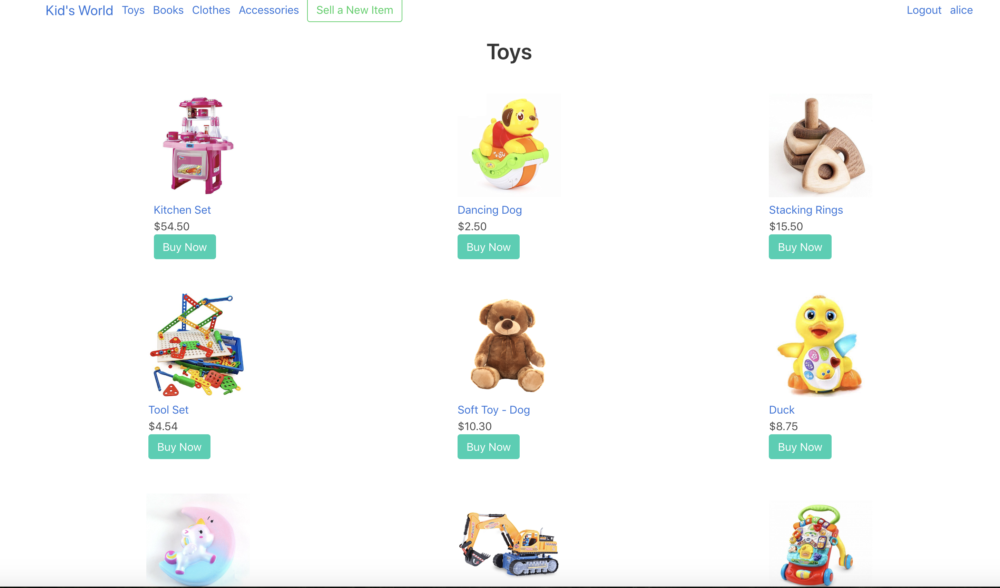

Item description


Add a new item page


Page displaying the items for sale from a user


Page displaying the items user has purchased
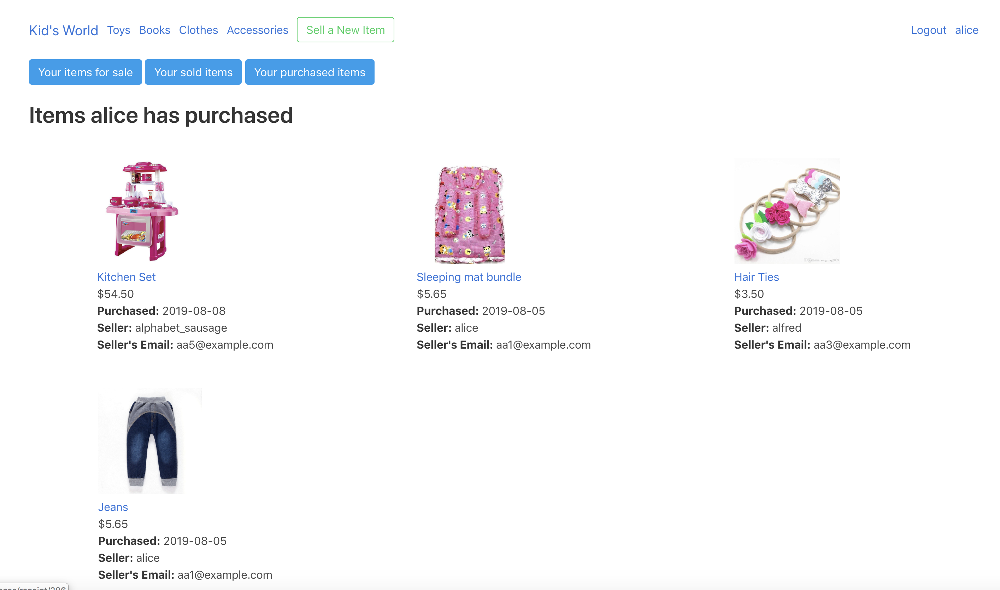

Page displaying the sold items of a user
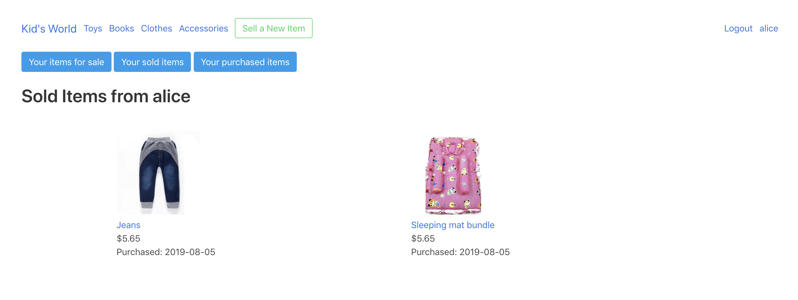

Payment using Stripe
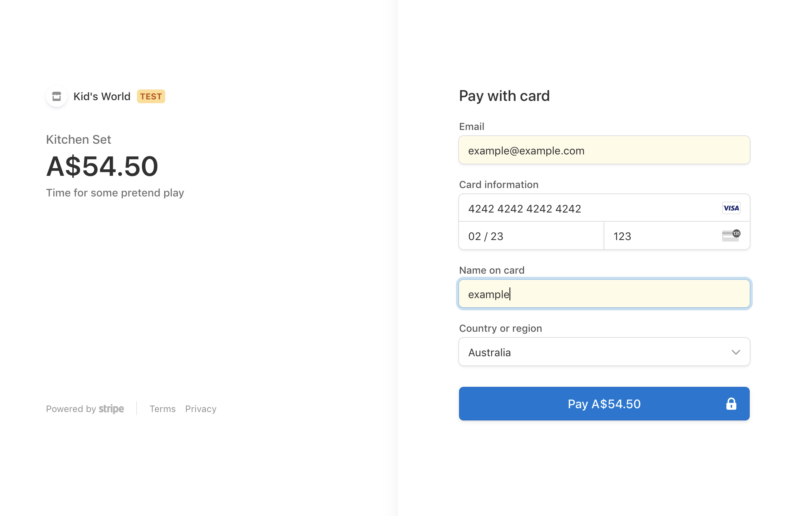

Order complete page


## Tech stack (e.g. html, css, deployment platform, etc)

Our tech stack includes:

- Ruby on Rails
- HTML
- SCSS (Including Bulma for some styling)
- Javascript for Stripe checkout
- Postgresql
- Heroku for deployment
- Cloudinary for image storage in production
- Stripe for payment processing
- Git/Github for source control
- Rspec for unit testing

## Instructions on how to setup, configure and use your App.

- fork and clone
- bundle install
- update `config/database.yml` with your postgresql username & password
- update `config/credentials.yml` with your cloudinary api key. In order to decrypt the file to edit, type
    ```EDITOR='code --wait' rails credentials:edit```
    into your command line.
- add your stripe api key to `app/controllers/purchases_controller.rb`
- `rails db:setup` - setup the database
- `rails db:schema:load` - load the schema for the database
- `rails db:seed` - load the items into the database
- `rails s` to run the server

The default server is located at http://localhost:3000/

### Sign Up, Log in and Log out of Accounts

On the top right side of the menu you can log in and out or sign up for an account. You do not need to be logged in to browse the website, but you will need an account to buy and/or sell an item.
To sign up, all fields are required, including username, email and password. A username must be unique. A password requires six characters.

### Browsing the Website

The left side of the menu has links to the categories and the homepage. You can browse through all the items or by category. You can click on an item's picture or title to access the individual item's page with additional information. You can also click on a seller's name to view all the items for sale by that particular seller.

### Purchasing an Item

If you try to purchase an item without being logged in, you are redirected to the login page.

To purchase an item, click on the "buy now" button. You will be redirected to a checkout page, to confirm you purchase. Click "checkout now" to purchase the item through Stripe. Upon completion of your purchase, you will be redirected to the completed purchase page.

### Selling an Item

When you are logged in, you can see a "Sell a New Item" button in the top menu. Click this to create a new item. Fill out the form - the title and price are the two required fields, but all are recommended. Click "submit" to add the item for sale.

### Editing and Deleting an Item

To edit or delete an item, first it must be an item created by the user that is currently logged in. To edit or delete an item, navigate to the individual item's page, and you will be able to access the "edit" and "delete" buttons.

### User Menu

When you click on a seller's username, you will be redirected to the seller's store with all the seller's items. If this is the current user that is logged in, you will have an extra menu that can access all your items currently for sale, your items that have been sold, and the items you have bought.

## Design documentation

Our design process included:

- Brainstorm ideas
- Created project timeline, breakdown of important tasks and user stories, and put them into our trello board.
- Designed our ERD
- Designed our wireframes
- Built the app, and refined our plans as we went along

## User stories

We created a list of user stories that we needed to complete for our MVP, as well as user stories as stretch goals. They are as follows:

- A user can view all items available for sale

    - Sold items would not be viewable so that they do not confuse the buyer. A user would not have to be logged in to see all the items.

- A user can buy an item

- A user can sell an item (create a listing)
    - A user can only create a listing if they are signed in.

- A user can edit and delete a listing
    - A user would only be able to edit and delete their own listings and if they are signed in.

- A user can upload an image to their listing

- A user can log in and out

- A user can view the details of an individual item

- A user can see a list of their past purchases (stretch goal)
    - Goal completed. A user can view their past purchases. We implemented a Purchases model to record who purchased what item.

- A user can see a list of their sold items (stretch goal)
    - Goal completed. A user can see their sold items, who purchased them, and the person's contact email

- A user can sort all the listings (by price, most recent, by category -- stretch goal)
    - We have implemented being able to select a category, as a part of our main menu. Sorting by most recent is the default view. In the future we would implement being able to sort by price, and other ways of sorting.

- A user can message another user (stretch goal)
    - We envision this will be so that users can contact other users through the website to organise pickup or delivery. At the moment, users get access to the person's email address which is not ideal.

- A user can sell postage for an item (stretch goal)
    - For this we would need to implement a new model that stores a user's address, as well as perhaps a postage model that has the different postage rates for items (this could possibly exist as a gem). In the item model we may need to include a place where a user inputs the weight of an item. There may also be a boolean for if the user wants to send and item or it to be pickup/delivery only (such as, if the item is too large to easily send). Postage would then have to be added to every order, and when the order is complete the seller would have access to the buyer's postage address.

## A workflow diagram of the user journey/s


## Wireframes

### Mobile
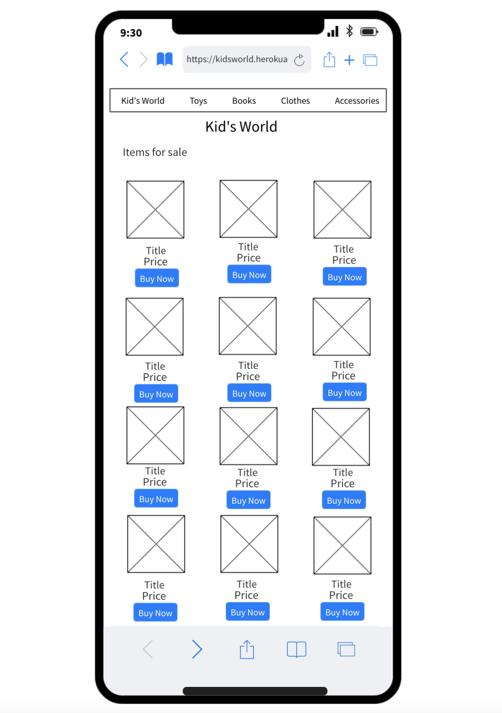
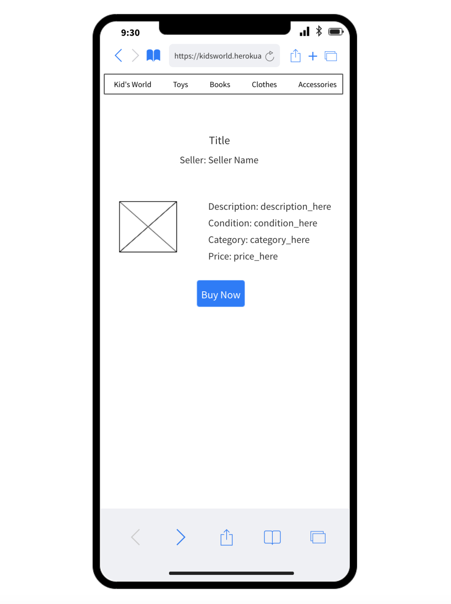
### Desktop & Tablet


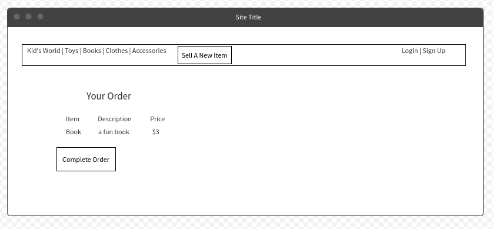

## Database Entity Relationship Diagrams

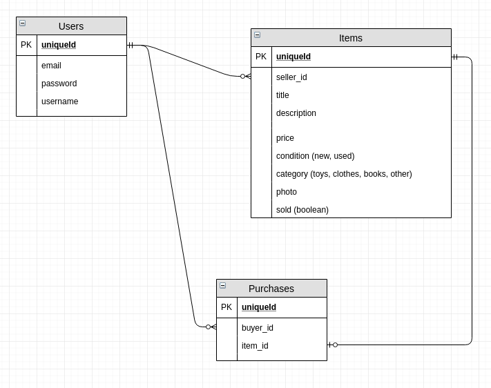

## Details of planning process

### Project Planning and Timeline

Our project timeline was as follows:

#### Week 1
- Monday - Brainstorm and setup
- Tuesday - ERD, Wireframes, planning discussion
- Wednesday - Set up models, controllers, devise

#### Week 2
- Monday - Images/cloudinary, view all items
- Tuesday - add, edit, delete items
- Wednesday - stripe integration

#### Week 3
- Monday - Add category pages, add user store page
- Tuesday - Finalise everything, make beautiful, finish readme
- Wednesday - make presentation


#### Trello
Day 2 - July 23rd Trello Board


Day 3 - July 24th Trello Board
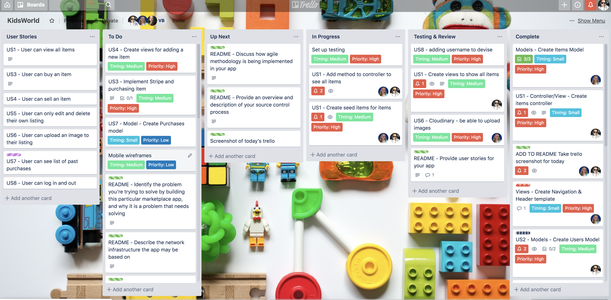

Day 4 - July 29th Trello Board
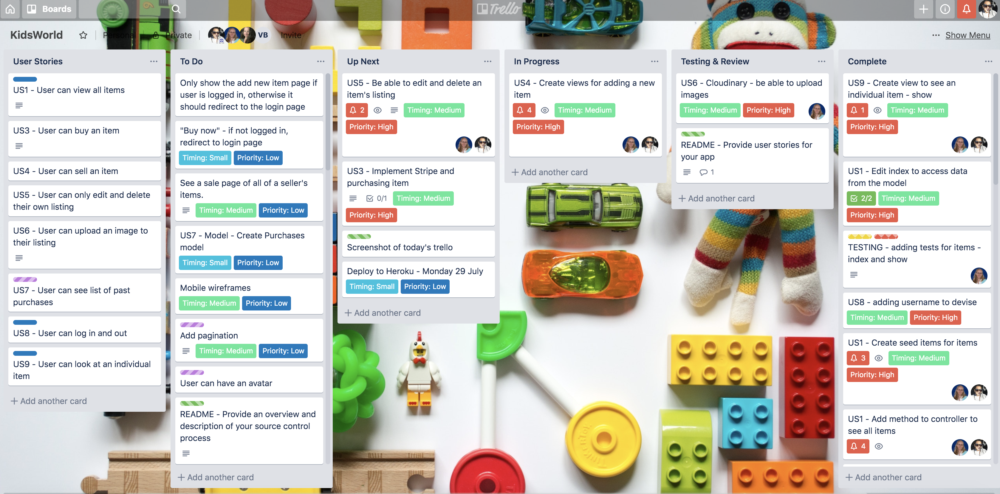

Day 5 - July 30th Trello Board


Day 6 - July 31st Trello Board
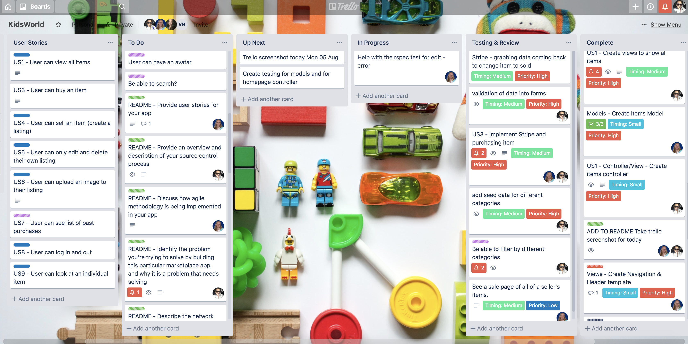

Day 7 - August 05th Trello Board
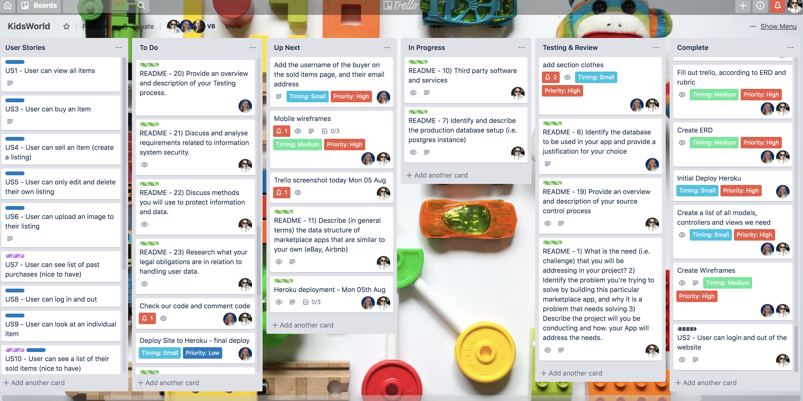

Day 8 - August 06th Trello Board
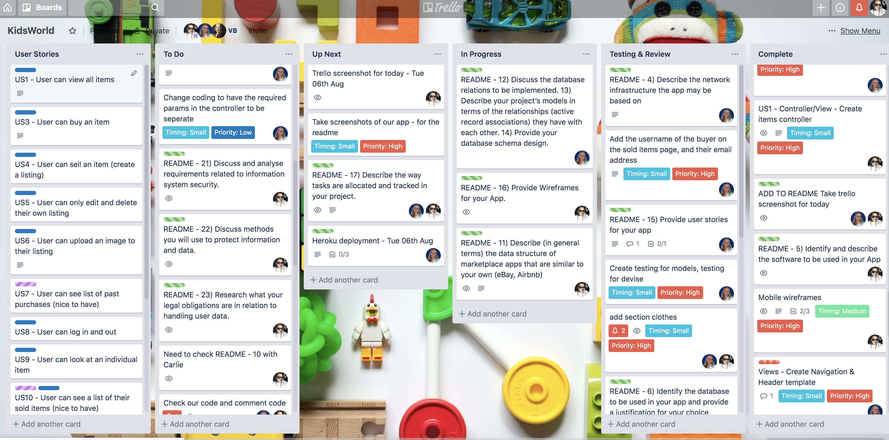

Day 9 - August 07th Trello Board
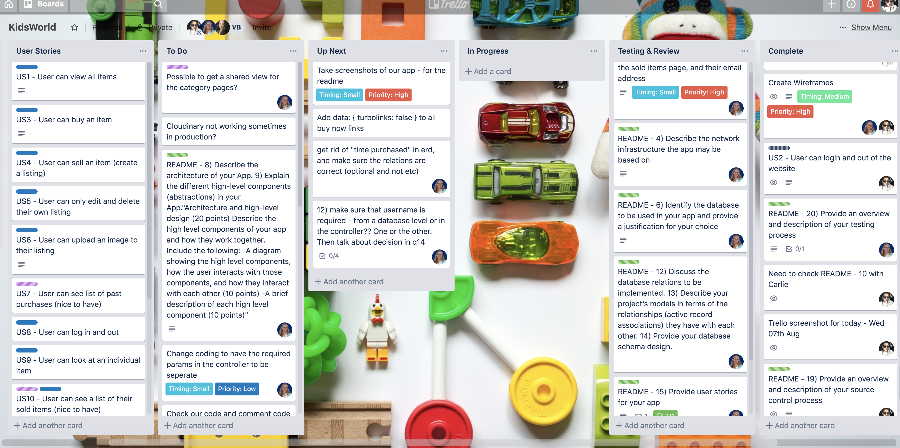

Final Trello Board
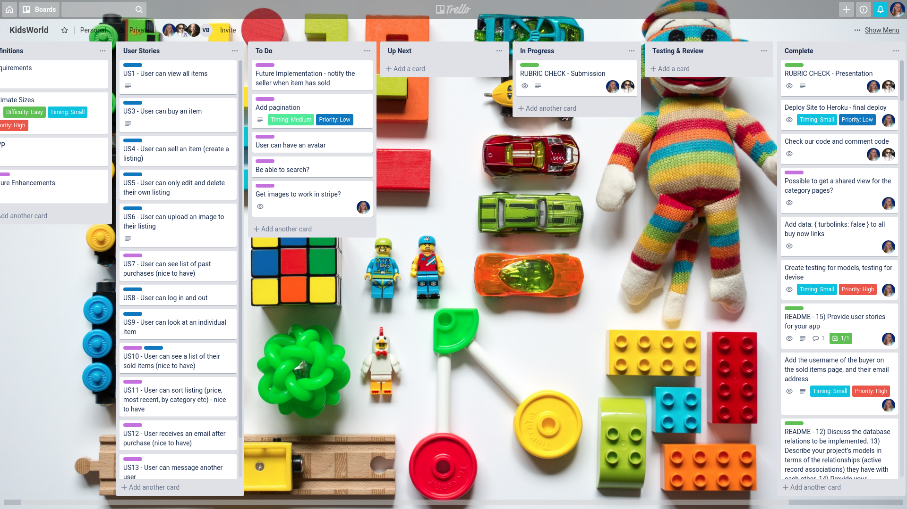

## Short Answer Questions

### 1) What is the need (i.e. challenge) that you will be addressing in your project?

Our website is an apt platform for bringing the buyers and sellers together to maintain sustainability by reusing items that are not damanged but serves its purpose. This helps in reducing wastage. Our website is a place to sell kids's items that are new and used - undamanged and in good condition. Buyers can find cheap and quality items at a very resonable price and they dont have to pay retail.

### 2) Identify the problem you’re trying to solve by building this particular marketplace App? Why is it a problem that needs solving?

Details mentioned in Question# 1 & 3.
Our website provides a safe and secure payment platform for the buyers. It also provides a wider customer base for the seller.

### 3) - Describe the project will you be conducting and how. your App will address the needs.

Parents always like to give quality products to their kids. But often, quality products are very expensive and not affordable by many. Our website allows parents to sell new and used kids items instead of throwing them out, and parents can buy quality products without having to pay retail. Often kids use a particular toy for a limited amount of time. Either they loose interest or they get new toys. The old toy is undamaged and still in good condition. So why not put the toy up for sale at a reasonable price so that other kids could also enjoy it ? Same is the case with books and clothes, kids soon outgrow the clothes and books meant for their age and don't need them anymore.

This thought made us bring up with an idea to create a website that could sell used and new toys, books, clothes and accessories like bedding etc so that every kid can enjoy and make memories in their childhood.

### 4) Describe the network infrastructure the App may be based on
The website is deployed to heroku, which is run on lightweight Linux servers called dynos. Dynos belong to one of three different configurations - web, worker, or one-off, and there are different types of dynos (that have different performance characteristics and properties, free dynos go to sleep) depending on the type of plan that a user has for their website.

You can "scale up" your website for when you need more ram, for instance - you use bigger dynos; or you can "scale out" your website for when you need more http requests (higher traffic) by adding more dynos. You can also run on more dynos for redundancy purposes, incase of dynos failing.

You can list the dynos of your app by typing `heroku ps` in your command line. For instance, our website currently has the following information:

`web (Free): bin/rails server -p $PORT -e $RAILS_ENV (1)
web.1: idle 2019/08/06 10:49:11 +1000 (~ 3h ago)`

Heroku automatically routes HTTP requests sent to your website to your web dynos. Routers use an algorithm to randomly spread HTTP requests across the web dynos. When heroku receives a HTTP request, the router establishes a new TCP connection to a random web dyno.

Heroku uses a postgresql database.

### 5) Identify and describe the software to be used in your App.

The different softwares used in our website are:

* Ruby - A dynamic, open source programming language. It has an elegant syntax that is easy to read and write. It supports multiple programming paradigms, including procedural, object-oriented, and functional programming.
Our website is created on the Ruby on Rails MVC framework which is an architectural pattern that separates an application into three main logical components: the model, the view,and the controller. The model and the controller components of our website are programmed in the Ruby language.

* Ruby on Rails - Rails, is a server-side web application framework written in Ruby. It is a model – view – controller (MVC) framework, providing default structures for a database, a web service, and web pages. The model and the controller components of our website are programmed in the Ruby language whereas the view components are programmed in the embeded ruby syntax along with HTML which alltogether makes up Rails.

* HTML - Hypertext Markup Language (HTML) is a markup language for documents designed to be displayed in a web browser. Web browsers receive HTML documents from a web server or from local storage and render the documents into multimedia web pages. HTML describes the structure of a web page semantically and originally included for the appearance of the document. We have used HTML in our views component which displays the pages of our website.

* CSS - Cascading Style Sheets (CSS) is a style sheet language used for describing the presentation of a document written in a markup language like HTML. We have done some basic styling in "app/assets/stylesheets/items.scss" file to make our website neat and clean. This page lists the items put on sale on our website.
    * Bulma - It’s a free, open source, and modern CSS framework based on Flexbox. We have used this for styling the buttons in our website like "Buy Now", "Edit", "Delete" etc.

* Cloudinary - A third-party cloud-based service used for image and video management solution. It enables users to upload, store, manage, manipulate and deliver images and video for websites and apps. In our website, we used this solution to store and manage images of the items the seller would like to sell.

* Stripe - A third-party service which allows individuals and businesses to make and receive payments over the Internet. In our website, we have a "Checkout Now" button with each item listed. When this button is clicked, the browser redirects to stripe where credit card data is handled. Once the payment is done by entering the credit card data, stripe will redirect the customer’s browser back.
    * We utilized some javascript to make the checkout redirect correctly to stripe.

* Heroku - A third-party cloud platform service where websites can be deployed. To deploy our website, we used Heroku's Git server which handles the application repository pushes.

* Rspec - A ruby gem for unit testing

More information can be found in Question# 10.

### 6) Identify the database to be used in your App and provide a justification for your choice

The database used in this app is postgresql. Postgres is an open source relational database.

When considering what database to use for this project, we ultimately chose postgres. One main advantage of using postgres is that it is natively supported with Heroku, our deployment platform.

In general, there are many advantages to using a postgres database. One advantage for us is the relational nature of the database, which helped with how we set up our ERD. This kind of database is good for transactional applications, another reason why it is a good fit for our project.

Being an open source database means that there would be many resources online to help us if we ran into any problems.

With the small nature of our app - only a few users and items to be implemented, with no real likelihood of needing to scale the app to a large amount of data - we did not have to fully explore the scalability of our database. That being said, one advantage of postgres is that it does scale to larger projects.

However it can become more memory intensive for larger databases. If we were looking at needing a larger scale database in the future, this may have been more of a consideration. With our app as it is, postgres is fast and performant, as well as providing secure data storage.

Postgres does have a GUI interface if needed to be used as well as the command line interface, so it can be used by people with a wide range of technical knowledge.

With the only real disadvantage being that it can have slower performance on larger datasets, and with many advantages from compatibiliy with heroku and the relational style of database, made postgresql the perfect database for our application.

### 7) Identify and describe the production database setup (i.e. postgres instance).

Heroku runs its own postgresql server instance. The database needs to be setup to run in the heroku (production) environment.
To set up the database, the following steps were followed:
* To create our tables from the db/schema.rb file - `heroku run rails db:schema:load`
* To update the changes made to the database structure (tables, columns) once changes where made after deploying to production - `heroku run rails db:migrate`
* To seed any data we need in production - `heroku run rails db:seed`

### 8) Describe the architecture of your App.

Our app is structured in the MVC - model, views, controller - architectural pattern.

Models interact with the database, accessing the required information from there. For instance, a function within the Item model may get all the items from the database where sold == false.

Views are the information that is presented to the viewer. In our app, the views are html and css, with embedded ruby so that we can get content dynamically. For instance, a view may present to the viewer a images of all the items that are not yet sold, as well as a "buy now" button.

Controllers pass the information from the model to the view, and also pass information back from the view (such as user input) to the model. So, for instance, for our view of the unsold items, the controller would get the information from the model, and may give the information an instance variable so that the view can easily access the data. Then, if a user purchased an item, the controller would let the model know that the database needs to be updated with sold == true.

### 9) Explain the different high-level components (abstractions) in your App.

#### Models

Our App has the following models:

The `Item` accesses information from the item's table in our database. We have different queries to access all the items, items from an individual seller, as well as items from a particular category.

The `Purchase` model gets information from the database about purchases. In particular we have functions to access information about purchases from a particular buyer, or information about the purchase of a particular item.

The `User` model validates that the username is present and unique, and a function that gets the username from the database. It was generated as part of Devise, the gem for handling user logins.

#### Controllers

`application controller` has functions for the entire application. In this case, we have defined a function needed for the Devise gem to permit usernames.

`buyer controller` is the section of our website about a user who buys an item. In this case it is getting information on the products a user has purchased.

`homepage controller` is for getting information needed for our homepage. This is a separate controller because we could extend the home page in the future to add different features to the homepage, such as, perhaps, access to a user's selling stats if they have logged in. At this point in time we have a method that accesses the six most recent items.

`items controller` - this controller supplies methods to give to the views around the items, as well as methods for destroying, creating and updating items.

`purchases controller` is for purchasing an item. It has methods for a new purchase, a complete purchase, and also a receipt view. It also creates a new row in the purchases table when a new purchase has been made.

`seller controller` - this controller is for the part of the website dedicated to a user who is a seller, and has methods to display sold items and the items for sale for a seller.

#### Views

`buyer folder` - for views associated with a user who is a buyer

`devise folder` - views to do with user authentication, from the devise gem, such as log in and new user pages

`homepage folder` - view for the homepage

`items folder` - views associated with the items, such as creating a new item, and the items sorted by category

`layouts folder` - the main template for a page in our application is here.

`purchases folder` - this is for views do do with purchases - a new purchase, a complete purchase, for instance.

`seller folder` - this folder is for views associated with a user as a seller, such as items a seller has for sale, and a list of items a seller has sold

`shared folder` - in this template we have partial templates, for the menu on every page, a menu for a user, and a template that shows a list of items.

### 10) Detail any third party services that your App will use.

The app will use the following third party services.

1) Cloudinary - A cloud-based image and video management solution. It enables users to upload, store, manage, manipulate and deliver images and video for websites and apps. In our website, we used this solution to store and manage images of the items the seller would like to sell.

2) Stripe - Allows individuals and businesses to make and receive payments over the Internet.
Industry standards require that we never store credit card details on our server. In our website, we have a "Checkout Now" button with each item listed. When this button is clicked, the browser redirects to stripe where credit card data is handled. Once the payment is done by entering the credit card data, stripe will redirect the customer’s browser back.

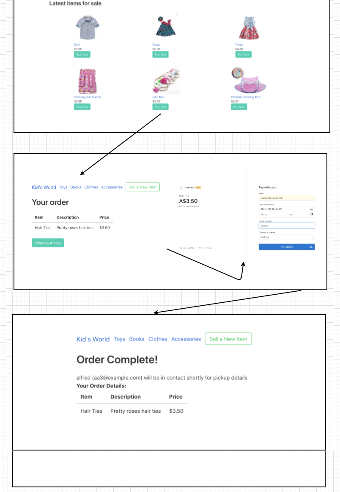

3) Heroku - A cloud platform service where websites can be deployed. To deploy our website, we used Heroku's Git server which handles the application repository pushes.

* To create a new git remote - `heroku create kidsworld`.
  The git remote created for our website is : https://kidsworld.herokuapp.com/
* To check the connection to the repository hosted on heroku - git remote -v
* To let heroku know the key value for the website to work, we need to set the master key in the heroku environment .The master key     can be found in the config directory in a file called master.key
* To set the master key - `heroku config:set RAILS_MASTER_KEY=<master-key>`
* To push to the heroku repo - `git push heroku master`
* To set up the database, the following steps were followed:
    * To create our tables from the db/schema.rb file - `heroku run rails db:schema:load`
    * To update the changes made to the database structure (tables, columns) once changes where made after deploying to production - `heroku run rails db:migrate`
    * To seed any data we need in production - `heroku run rails db:seed`
* To open the website in heroku - `heroku open`.
  The webpage https://kidsworld.herokuapp.com/ opens up in the browser.

### 11) Describe (in general terms) the data structure of marketplace apps that are similar to your own (e.g. eBay, Airbnb).

Our website's data structure is similar to that of Etsy.

Etsy has tools for the sellers to allow them to represent their inventory more accurately in their listings, giving them more control over how they set their prices and manage their stock. It also allow sellers to describe their items in ways that have a consistent meaning to buyers. For example, the seller can mention the category, size etc so that buyers can search for an item based on the filters.

Our website allows sellers to advertise their inventory based on the category etc so that buyers can browse through the categories in our website to find a particular item. We would like to implement a search functionality for our website as a future enhancement so that buyers can search for a particular item.

### 12) Discuss the database relations to be implemented.

Our database, as outlined in the ERD (above), shows that it is a relational database. The information in one table is related to the information in other tables.

When considering our database design, we had to consider what information would be needed without creating a redundancy of information, so that each piece of information is in the database only once. This reduces the risk of out-of-date information so that the data is more accurate.

For instance, with our Purchases model, all we needed to do was reference the Users and the Items table with the unique id of the buyer and the item. Then, through the item we would be able to also access all the information on the seller. This is because of the relational nature of the database.

We considered that each cell in a table would only have one piece of data and not an array of data, to make our tables normalised. For instance, if in the future a user can add more than one object to a cart, we could of had a row that shows all items in one cart in one row - this would be an array of items. Instead, we would have multiple rows in our Purchases table referencing the one order.

In a future implementation, we could easily add on to our database. For instance, if we needed to capture a user's postal address, we could create a new table an have that reference the  unique id of the User. We could also add tables when we would implement messaging between users, and we would have to consider the normalisation of data when doing so.

### 13) Describe your project’s models in terms of the relationships (active record associations) they have with each other

Our application has three models, Item, Purchase and User.

The Item model belongs to the User, and a User has many Items. In our case, an item that belongs to User, that User is called a Seller. An item can not exist without a Seller.

The Purchase model belongs to both the Item and User model. In this case, the User that belongs to the Purchase is called a Buyer, as that user has bought an item. Each item can have one purchase (but not necessarily have a purchase). A Buyer can have many purchases. A Purchase can not exist without a Buyer or an Item.

A User can be both a Buyer and a Seller, or may not have any Items or Purchases at all.

In our ERD, we called the User's Unique ID as either the buyer_id and the seller_id so that it would be clear as to what kind of job the user would have for each table.

### 14) Provide your database schema design

For our User model, we have the following schema design:

```
email: string, default: "", null: false
username: string, null: false
encrypted_password: string, default: "", null: false
reset_password_token: string
reset_password_sent_at: datetime
remember_created_at: datetime
created_at: datetime, null: false
updated_at: datetime, null: false
["email"]: index, name: "index_users_on_email", unique: true
["reset_password_token"]: index, name: "index_users_on_reset_password_token", unique: true
```

The User model was generated by Devise, a gem, and we added the Username column, as a string. We made it required so that a user must sign up with one. We use the username all throughout the store, so it must be added.

The Items model schema:
```
"seller_id": bigint, null: false
"title": string, limit: 100, null: false
"description": string, limit: 250, null:false
"condition": integer
"category": interger
"sold": boolean, default: false
"created_at": datetime, null: false
"updated_at": datetime, null: false
"price": decimal, precision: 8, scale: 2
["seller_id"]: index, name: "index_items_on_seller_id"
```

Of note, our condition and category columns are integers. That as because they are then defined as a enumerable (enum) in our Item model.
We also have set price as a decimal with precision as 8 (total 8 digits), and the scale as 2 (two decimals places).

We decided that the core pieces of required information would be the Title and Price. All other sections are not required to make a new item. The seller_id should automatically be added, but we required it so that a new record could not be made without one.

Title and Description have limits to the amount of characters in order to fit with the expected results of what we want users to input. We did not want users to put in a super long title, but it would be acceptable for a description.

The Sold column is a boolean, that defaults to false. This way, when a new item is created the user doesn't choose if it is sold or not, it is created as false. When the item is sold, it is changed to true.


And the Purchases model schema:
```
"buyer_id": bigint, null: false
"item_id": bigint, null: false
"created_at": datetime, null: false
"updated_at": datetime, null: false
["buyer_id"]: index, name: "index_purchases_on_buyer_id"
["item_id"]: index, name: "index_purchases_on_item_id"
```
The Purchases table references the Item and User table. We wouldn't expect buyer_id and item_id to be empty, so we made the restraint to be null: false.

Our foreign keys in the schema are as follows for these models:
```
add_foreign_key "items", "users", column: "seller_id"
add_foreign_key "purchases", "items"
add_foreign_key "purchases", "users", column: "buyer_id"
```

We also have active storage tables in our database for our image uploads. They are as follows:

```
 create_table "active_storage_attachments", force: :cascade do |t|
    t.string "name", null: false
    t.string "record_type", null: false
    t.bigint "record_id", null: false
    t.bigint "blob_id", null: false
    t.datetime "created_at", null: false
    t.index ["blob_id"], name: "index_active_storage_attachments_on_blob_id"
    t.index ["record_type", "record_id", "name", "blob_id"], name: "index_active_storage_attachments_uniqueness", unique: true
  end

  create_table "active_storage_blobs", force: :cascade do |t|
    t.string "key", null: false
    t.string "filename", null: false
    t.string "content_type"
    t.text "metadata"
    t.bigint "byte_size", null: false
    t.string "checksum", null: false
    t.datetime "created_at", null: false
    t.index ["key"], name: "index_active_storage_blobs_on_key", unique: true
  end

    add_foreign_key "active_storage_attachments", "active_storage_blobs", column: "blob_id"
  ```

### 15) Provide User stories for your App.

The user stories were explained in detail in the first section of this readme. Here is a summary of the user stories:

- A user can view all items available for sale
- A user can buy an item
- A user can sell an item (create a listing)
- A user can edit and delete a listing
- A user can upload an image to their listing
- A user can log in and out
- A user can view the details of an individual item
- A user can see a list of their past purchases (stretch goal - reached)
- A user can see a list of their sold items (stretch goal - reached)
- A user can sort all the listings (by price, most recent, by category -- stretch goal)
- A user can message another user (stretch goal)
- A user can sell postage for an item (stretch goal)


### 16) Provide Wireframes for your App.

The wireframes were detailed the first section of this readme.

We originally had a different concept for the wire frames. Our original homepage wireframe for desktop was designed such as:

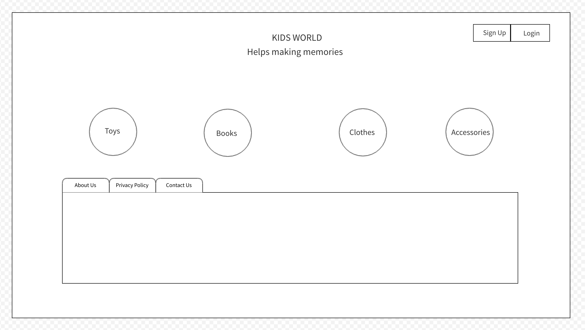

We ended up changing this as we worked on a project. This is an example as well as our team using agile methodology in our project - continually itterating and revisiting our plans and changing them if necessary for our project.

### 17) Describe the way tasks are allocated and tracked in your project.

Our team used a trello board to create and track our tasks. We created cards that align with the user stories and the project's rubric, in order to make sure that we covered every angle that we needed for the project.

We had a column in our trello board that referenced the requirements, sizing, priorities, and timings, as well as what we hoped to achieve in our MVP and possible future enhancements. Our second column was a reference to our numbered user stories so that we could quickly see what card was referencing what user story.

Our main columns for the Trello board were as follows:
 - To Do - a long list of the tasks we wished to get done
 - Up Next - cards we had prioritised to work on next when we were finished what we were currently working on. This allowed some easier sorting and prioritising of our tasks.
 - In Progress - cards we were currently working on
 - Testing and Review - cards which were waiting to be checked and merged into master in a pull request. These cards may need to be moved back into in progress if necessary after the review
 - Complete - our finished tasks.

Each day we worked on a daily sprint with a goal of what we wanted to complete. We talked together on what each wanted to do in order to meet our daily goal, and tasks were then allocated to each team member. Some tasks we worked together in pair programming, other times we worked individually on a task.

We utilized some labels in our trello board, such as Purple for future enhancements, and green for documentation.

### 18) Discuss how Agile methodology is being implemented in your project.

Although we were only a team of two, we implemented numerous agile methodologies in our workflow.

We broke down our user stories, and then integrated them into tasks on our trello kanban board (see the trello screenshot section).

We worked closely together, often utilizing pair programming, and we marked this time off on our trello boards as both working on the task. We also worked in daily sprints, utilising our trello board to track these sprints.

We participated in the classroom-wide stand up, which meant that we also together went through what we did the previous day, our goal for that day's sprint, and any obstacles that we were facing.

Our coding focused on feature driven development, aligning with our user stories, and we used [unit testing](https://github.com/BlueCodeThree/KidsWorld/blob/testing/log/test_results.log) to test our implementation.

We deployed early and often to Heroku, changing our requirements for the project if necessary. One example is changing the original wireframes for our website when it did not suit as our project was developed.

### 19) Provide an overview and description of your Source control process.

Source control is the process of tracking code changes, able to view the revision history of the code, and be able to rollback to previous versions when needed.

The source code management system that we used is Git. We created a git repository for our app. We used a feature branch workflow for our source control process.

 We have the master branch and created feature branches using the command 'git checkout -b branch-name' to work on our code independently.

 Once we have finished our code changes on a particular branch, we used the commands 'git add' and 'git commit' to store our changes locally. We then used 'git push origin branch-name' to push our local changes to the feature branch in the git repository.

 The other teammate could then pull down the branch using a pull request, review and test the code change, then accept/decline the changes, leave comments and push/merge it to the master branch if everything works fine.

 We have faced some merge conflicts and figured out what changes needs to be accpeted and have resolved the conflicts. We have worked independently on feature branches and have done frequent commits to the master so that its easy to manage and does not break the functionality.


### 20) Provide an overview and description of your Testing process

We used rspec and the rails-rspec gem to do unit testing.

To run rspec we would use the following command: `rspec -f d <file-name (optional)>`

After there was a change in a result in the testing, we would save the results to our [test log](log/test_results.log)

Some examples of the tests that we ran that align with our user stories include:

- A user can view all the items for sale - testing the item's index page, as well as the item's show page, and also these views are aligned with the controller.
- A user can delete and edit a listing was tested in the item's controller. A user must be signed in and the item belong to them in order to complete these tasks
- A user can sell an item (create a listing) - as tested in the items new view and the items controller.

We tested the creation of entries for each model, the routing for pages as well as items in the controllers, and views. In total we have 36 passing tests.

In the future we would love to implement more of a test driven development, rather than testing after a controller/view/model has been created.  We believe TDD will be easier now that we have an understanding of how rspec works with rails.

### 21) Discuss and analyse requirements related to information system security.

Answer combined with the following question.

### 22) Discuss methods you will use to protect information and data.

In creating a website such as this, one has many things to consider when it comes to information and security. Here are some of the things to consider:

- Gathering user information (a user can log in and out)

When a user registers, they are handing over sensitive information, such as their private email address that they do not want spammers to access, and their private password. We are using the Devise gem that provides some security for a user's information, such as storing the password in the database encrypted.

In a future implementation, we could change logins to be through google or facebook, so that we do not have to save that information on our database. A trade off of this may be that we then wouldn't have as much access to our user data if we needed this for our own analysis of our users.

- A user purchases items with a credit card

User is asked to enter the credit card data to buy an item. Industry standards require that we never store credit card details on our server. To avoid such sensitive data being stored on our servers we send the customer to 'Stripe' - a third-party service which takes care of this. Once the payment is done by entering the credit card data, stripe will redirect the customer’s browser back.

- Users can edit and delete listings

Checks are in place so that only a user that created the item can edit or delete that item. 

- Users contacting each other

At the moment to facilitate a transaction to be completed, a buyer and a seller are given each other's contact information - their email addresses. This could cause problems handing out people's email addresses, even if only a logged in user who has bought or sold a product can see it. In a future implementation of the app, a messaging system could be set up so that users can contact each other without having to see each other's private email address.

- Users can sell postage and post out sold items

As part of a future enhancement, providing postage as part of the integration of the website seems likely. This means that the website will be handling sensitive information such as a user's physical address, and steps would be needed to make sure that information in the database was secure, as well as that when that information was displayed to a customer, the displayed page is secure to only the seller in order to ship out the product.

- Keeping gems and websites up to date

Many successful internet hacks are due to websites not having their software up to date, and security flaws have been discovered. In order to make the website less vulnerable to attacks, we would have to make sure that our gems, rails and ruby versions were updated to the latest stable versions, and that all code if found to be vulnerable was updated asap.

### 23) Research what your legal obligations are in relation to handling user data.

In Australia, under the Privacy Act of 1988, we are required to protect personal information from:
- theft
- misuse
- loss
- unauthorised access
- modification
- disclosure

As well as this, we must take reasonable steps to destroy or de-identify personal information when it is no longer needed.

A user's information should not used in any way that a user has not authorized it to be used, so for instance it should not be shared or sold to a third party. This data should also be stored in a database and access to this database is strictly controlled by authentication and authorization. Sensitive information such as passwords and credit card information should be encrypted.

When using production data in other environments like test and UAT, user's personal information like name, email-id etc are   masked so that user cannot be identified.

Privacy policy page (a future enhancement feature) which explains why our website collects personal information and what is done with it. For Example, the third-party service 'Stripe' may use the payment data for analysing consumer spending habits.

Under GDPR legislation, users from Europe have the right to access any information that is being held about them, so one must be able to provide this information. They also have a right to erasure, so one must work out how their personal information can be destroyed if requested.
